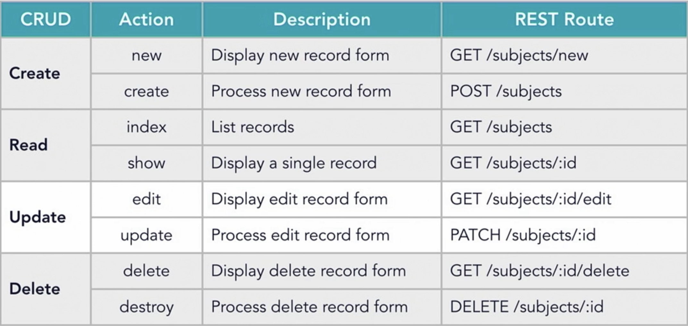
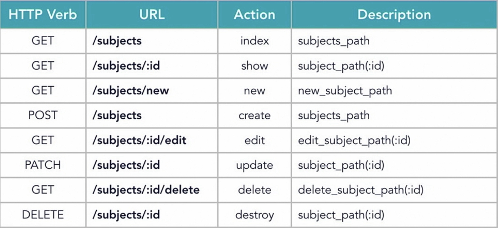

# simple-cms

A simple content management system built with Ruby on Rails that implements CRUD actions and a RESTful API.

## Getting Started

These instructions will outline the steps I went through to create this project.

### Prerequisites

- A working command line
- Ruby
- Rails
- PostgreSQL

### Installing and Running PostgreSQL on macOS

```console
foo@bar:~$ brew install postgres
foo@bar:~$ rm -rf /usr/local/var/postgres
foo@bar:~$ pg_ctl -D /usr/local/var/postgres start
```
To initialize a PostgreSQL database cluster, run the following command:

```console
foo@bar:~$ initdb /usr/local/var/postgres
```

To delete a PostgreSQL database cluster, run the following command:

```console
foo@bar:~$ rm -r /usr/local/var/postgres
```

To create a new super user with a password, run the following command:

```console
foo@bar:~$ createuser -P -s your_username
```

To create a new database with your user as the owner, run the following command:

```console
foo@bar:~$ createdb -U your_username your_database
```

To grant your user privileges in your database, run the following commands:

```console
foo@bar:~$ psql -d your_database -U your_username
your_database=> GRANT ALL PRIVILEGES ON DATABASE "CSCE431_Lab1_development" TO rails_user;
```

## Utilizing Credentials in Rails

Rails has a built in way for handling sensitive information. In the project's config directory, there is an encrypted file called "master.key." This is the proper place to store sensitive information such as usernames and passwords.

To edit this file in vim, run the following command

```console
foo@bar:~$ EDITOR="vim" credentials:edit
```
If you want to change the base secret, run the following command and paste the result over the previous base key in master.key:

```console
foo@bar:~$ rails secret
```

To utilize these credentials in a file, simply type the following in the place where you want to insert the result.
```erb
<%= Rails.application.credentials.your_value %>
```

## Implement CRUD Actions in Rails

CRUD Actions and their descriptions.



Resourceful route helpers in Rails.



**Note:** These pictures were taken from the *Ruby on Rails 6 Essential Training* course on LinkedIn Learning.

## Configure asset pipline for JavaScript

  - Tell assest pipline to precompile JavaScript again
    - add the following to app/assets/config/manifest.js
  ```js
  //= link_directory ../javascripts .js
  ``` 
  - Create a new directory for the JavaScript and add a manifest file
    - Under config, create javascripts/application.js with the following:
  ```js
  //= require rails-ujs
  //= require activestorage
  //= require turbolinks
  //= require_tree .
  ```
  - Provide a JavaScript compressor for production
    - add ```gem 'uglifier', '>= 1.3.0'``` to Gemfile
    - add ```config.assets.js_compressor = :uglifier``` to environments/production.rb
  - Disable Webpacker **(optional)**
    - Comment out webpacker gem from Gemfile
  - Run the following command to complete the changes
```console
foo@bar:~$ bundle install
```

## Authors

* **Michael Roush** - *Project completion*

## License

Copyright © 2020 Michael Roush. All rights reserved.